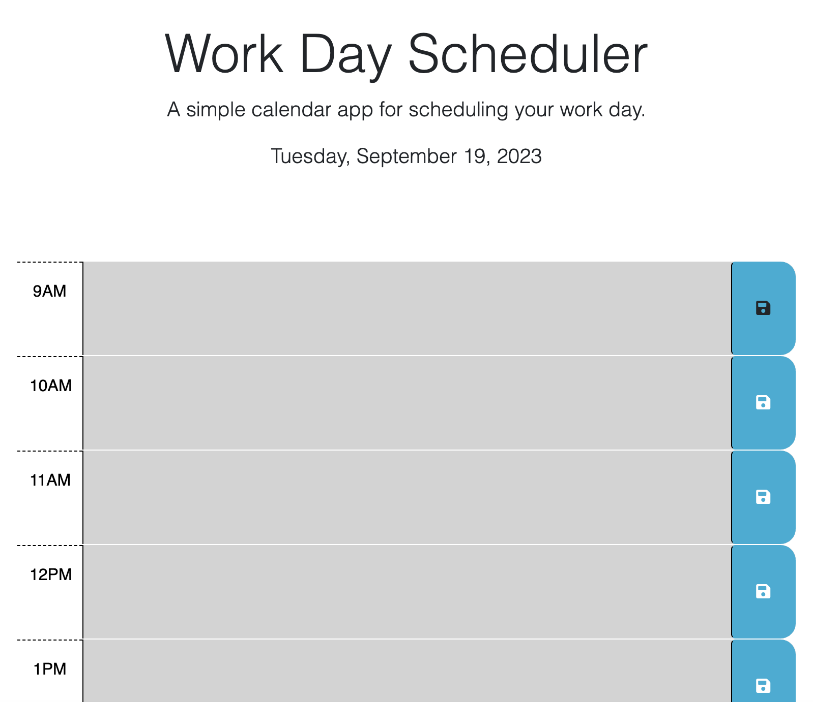

# Scheduler

## Description

This page generates a 9 am to 5 pm scheduler.

## Acceptance Criteria

It is done when...

The user can use the planner to create a daily schedule.

Upon opening the page, the current date is displayed at the top of the calendar and each time block is color-coded to indicate whether it is in the past, present, or future

The user can enter an event on each time block that will save to local storage.

The event stays on the page after refresh.

## Page

## Credits

N/A

## License

Please refer to the LICENSE in the repo.

